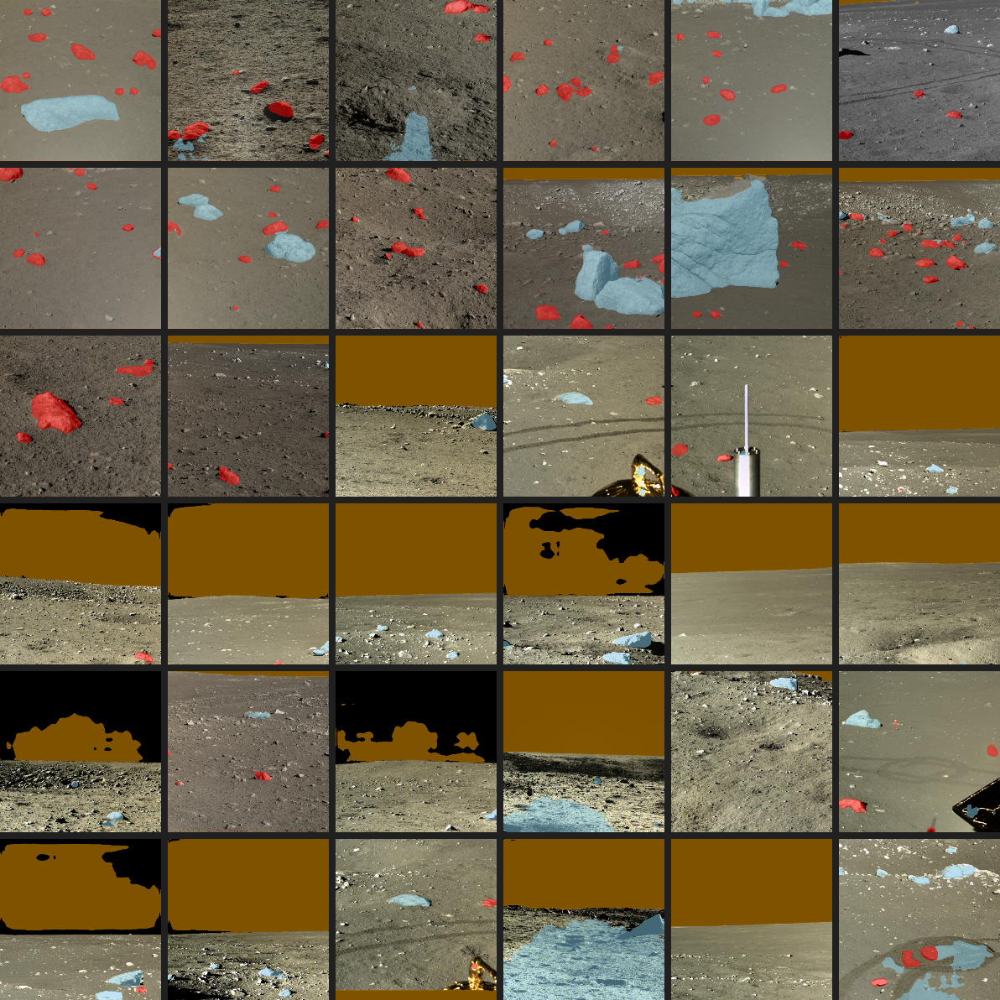

# 🌙 LunarSite

**End-to-end machine learning pipeline for lunar south pole landing site selection.**

A pre-mission analysis tool that combines deep learning for hazard detection with gradient-boosted scoring and SHAP explainability to rank candidate landing sites in the 80°S–90°S region. Built to fill the gap between NASA's deterministic SPLICE flight system and academic ML research on lunar terrain analysis.

> **Motivation:** The Intuitive Machines IM-2 south pole lunar crash (March 2025) validated the need for machine learning approaches to landing site selection — classical geometric algorithms failed under the extreme lighting conditions of the south pole. LunarSite is an attempt to build the kind of ML-first pre-mission analysis tool that the commercial lunar industry needs.

## 🚀 Live Demo

**[Try the interactive demo →](https://REPLACE_WITH_STREAMLIT_URL)**

The demo shows **Stage 2 (terrain segmentation)** — upload any lunar image and the model returns a per-pixel classification into background, small rocks, large rocks, and sky. Also includes a gallery of real moon photography showing sim-to-real transfer from purely synthetic training data.



*36 real moon photos with model predictions overlaid. Model was trained only on synthetic Unreal Engine scenes and has never seen real lunar imagery during training.*

## 📊 Current results (Stage 2 locked)

| Configuration | Test mIoU | Notes |
|---|---|---|
| **v1: ResNet-34 + Dice+CE + flip TTA** | **0.8456** 🏆 | Production config |
| v1: ResNet-34 standard | 0.8425 | Baseline |
| v2: ResNet-50 + Focal+Dice + class weights + flip TTA | 0.8429 | Ablation — lost by 0.003 |
| v1: ResNet-34 + multi-scale TTA | 0.8439 | Harmful, 3× slower, discarded |

**Per-class IoU (production config):**

| Class | IoU |
|---|---|
| background (regolith) | 0.9759 |
| small_rocks | 0.9749 |
| large_rocks | 0.7176 |
| sky | 0.7141 |

**Sim-to-real transfer (36 real moon photos, zero domain adaptation):** class distribution preserved within 2 percentage points of training distribution on real data. Model transfers coherently with one interpretable failure mode (bright sun-lit rocks occasionally misclassified as sky).

## 🏗️ Architecture

LunarSite is a three-stage pipeline. Each stage can be trained and evaluated independently; their outputs are combined in Stage 3 to produce a final site ranking.

```
┌─────────────────────────────────────────────────────────────────┐
│                    LunarSite Pipeline                           │
│                                                                 │
│  ┌──────────────┐  ┌──────────────────┐  ┌──────────────────┐  │
│  │ Stage 1       │  │ Stage 2          │  │ LOLA GeoTIFFs    │  │
│  │ Crater Det.   │  │ Terrain Seg. ✅  │  │ (slope, elev,    │  │
│  │ U-Net / DEM   │  │ U-Net / RGB      │  │  roughness)      │  │
│  └──────┬───────┘  └────────┬──────────┘  └───────┬─────────┘  │
│         │ crater_density     │ rock_coverage_%     │ slope      │
│         │ crater_min_dist    │ large_rock_count    │ elevation  │
│         │ avg_crater_radius  │ shadow_coverage_%   │ roughness  │
│         └────────┬───────────┴──────────┬──────────┘            │
│                  │                      │                       │
│           ┌──────▼──────────────────────▼──────┐                │
│           │       Stage 3: XGBoost Scorer      │                │
│           │   22+ features → site suitability  │                │
│           │        + SHAP explainability       │                │
│           └────────────────┬───────────────────┘                │
│                            │                                    │
│                    ┌───────▼────────┐                           │
│                    │  Ranked Sites  │                           │
│                    │  80°S – 90°S   │                           │
│                    └────────────────┘                           │
└─────────────────────────────────────────────────────────────────┘
```

Only **Stage 2** is currently implemented and shipped. Stage 1 (crater detection) and Stage 3 (site scorer) are in the roadmap.

## 🗺️ Ship definition

LunarSite has three build layers, each with a distinct role:

- **Layer 1 — Foundation** *(complete)*: Stage 2 terrain segmenter + sim-to-real evaluation + Streamlit demo. Not "LunarSite" yet — it's "a good lunar terrain segmenter" that validates the core ML capability works and establishes the data → train → eval → deploy pattern.
- **Layer 2 — Deepening** *(in progress, the real ship)*: Layer 1 + deep ensemble uncertainty + Stage 1 crater detection + Stage 3 XGBoost scorer with LOLA features + full Streamlit demo with coordinate input and SHAP explanation. This is LunarSite as pitched.
- **Layer 3 — Validation & End Game** *(post-ship)*: Dark terrain module for permanently shadowed regions, MC Dropout uncertainty, arXiv paper, commercial outreach to Intuitive Machines / Firefly / Astrobotic / ispace, community launch.

## 📁 Project structure

```
Moon/
├── streamlit_app.py               # Interactive demo (Stage 2)
├── demo_assets/                   # Preloaded demo examples + manifest
│   ├── real_moon/                 # Curated sim-to-real overlays
│   ├── synthetic/                 # Benchmark example with GT
│   └── contact_sheet.png          # 36-image overview
├── best_resnet34.pt               # Production Stage 2 weights (97 MB)
├── scripts/
│   ├── kaggle_run.py              # Kaggle kernel automation (push/wait/pull)
│   ├── sim_to_real_eval.py        # Run Stage 2 on real moon images
│   ├── build_demo_assets.py       # Regenerate demo_assets/ from model
│   ├── train_segmenter.py         # Stage 2 training
│   ├── train_crater_detector.py   # Stage 1 (not yet implemented)
│   └── train_scorer.py            # Stage 3 (not yet implemented)
├── notebooks/
│   ├── train_segmenter_kaggle_v2.ipynb  # v2 training (Kaggle T4 x2)
│   ├── eval_v1_vs_v2_kaggle.ipynb       # Full v1 vs v2 eval matrix
│   └── train_segmenter_colab.ipynb      # Original v1 training (Colab A100)
├── src/lunarsite/                 # Python package (importable)
├── configs/                       # YAML configs per stage
├── models/                        # Gitignored checkpoints
├── outputs/                       # Gitignored experiment outputs
└── CLAUDE.md                      # Full project specification
```

## 🛠️ Setup

### Quick start (demo only)

```bash
git clone https://github.com/AlanSEncinas/Moon.git
cd Moon
pip install -r requirements.txt
streamlit run streamlit_app.py
```

The demo ships with a pre-generated `demo_assets/` folder and the production checkpoint `best_resnet34.pt` — no data download needed.

### Full development setup

```bash
# Create environment (conda recommended for GDAL)
conda create -n lunarsite python=3.11
conda activate lunarsite
conda install gdal  # needed for Stage 3 geospatial work

pip install -r requirements.txt
pip install -e .  # editable install of lunarsite package

# Download Stage 2 dataset via kagglehub
python scripts/download_data.py --stage 2
```

## 🔬 Reproducing the results

**Stage 2 training (Kaggle T4 x2, ~6 hours):**

```bash
# 1. Set up Kaggle CLI with API token at ~/.kaggle/kaggle.json
# 2. Register the training kernel in scripts/kaggle_run.py
# 3. Push, wait, pull
python scripts/kaggle_run.py run eval_v1_vs_v2
```

**Sim-to-real evaluation (local, ~30 seconds on CPU):**

```bash
python scripts/sim_to_real_eval.py --tta
```

Outputs go to `outputs/sim_to_real/v1_tta/` including per-image overlays, a contact sheet, and a summary JSON.

**Regenerate demo assets:**

```bash
python scripts/build_demo_assets.py
```

## 📦 Data sources

| Stage | Dataset | Source | Status |
|---|---|---|---|
| 2 (train) | Artificial Lunar Rocky Landscape (9,766 synthetic) | [Kaggle: romainpessia](https://www.kaggle.com/datasets/romainpessia/artificial-lunar-rocky-landscape-dataset) | ✅ Used |
| 2 (real eval) | 36 real moon photos (paired with GT masks) | Included in above | ✅ Used |
| 1 (train) | Martian/Lunar Crater Detection | [Kaggle: lincolnzh](https://www.kaggle.com/datasets/lincolnzh/martianlunar-crater-detection-dataset) | ⏳ Roadmap |
| 3 (features) | LOLA Gridded Products (20 m/px DEM + derivatives) | [NASA PGDA](https://pgda.gsfc.nasa.gov/products/90) | ⏳ Roadmap |
| 3 (validation) | NASA Artemis III candidate regions (9 sites) | NASA | ⏳ Roadmap |

## 🎯 Validation target

Top-ranked sites from Stage 3 should overlap with NASA's nine Artemis III candidate regions: Cabeus B, Haworth, Malapert Massif, Mons Mouton Plateau, Mons Mouton, Nobile Rim 1, Nobile Rim 2, de Gerlache Rim 2, Slater Plain. Benchmark: ResGAT-F found 7.81% of south pole area suitable — our model should find similar.

## 📋 Roadmap

### Layer 1 — Foundation ✅
- [x] Stage 2 terrain segmenter (v1 ResNet-34, test mIoU 0.8456)
- [x] v1 vs v2 head-to-head evaluation with full TTA matrix
- [x] Sim-to-real qualitative evaluation on 36 real moon photos
- [x] Streamlit v0 demo with preloaded examples

### Layer 2 — Deepening 🚧
- [ ] Deep ensemble (4-5 v1 runs with varied seeds) for epistemic uncertainty
- [ ] Stage 1: crater detection U-Net on DEM tiles
- [ ] Stage 3: XGBoost site scorer with LOLA features + SHAP
- [ ] End-to-end pipeline script
- [ ] Streamlit demo v3: coordinate input → full pipeline output

### Layer 3 — Validation & End Game 🔮
- [ ] Dark terrain module (ShadowCam, HORUS denoising, shadow-depth validation)
- [ ] MC Dropout uncertainty (alternative to deep ensemble)
- [ ] arXiv paper on novel contributions
- [ ] Commercial outreach to lunar lander companies
- [ ] Community launch (Reddit, HN, space Twitter)

## 📜 License

MIT — see [LICENSE](LICENSE) if present, otherwise this statement is the license grant.

## 🙏 Acknowledgments

- **Romain Pessia** for the [Artificial Lunar Rocky Landscape Dataset](https://www.kaggle.com/datasets/romainpessia/artificial-lunar-rocky-landscape-dataset) on Kaggle
- **Pavel Iakubovskii** for [`segmentation_models_pytorch`](https://github.com/qubvel-org/segmentation_models.pytorch)
- **NASA PGDA** for LOLA gridded products (to be used in Stage 3)
- **Kaggle** for free T4 GPU compute

## 👤 Author

**Alan Encinas** — solo developer building LunarSite as a portfolio project and genuine contribution to open-source lunar science tooling. Not affiliated with NASA, JPL, or any commercial lunar company. Motivated by childhood excitement about space and the observation that the commercial lunar industry is starting to need tools like this.

[GitHub](https://github.com/AlanSEncinas) · [Demo](https://REPLACE_WITH_STREAMLIT_URL)
