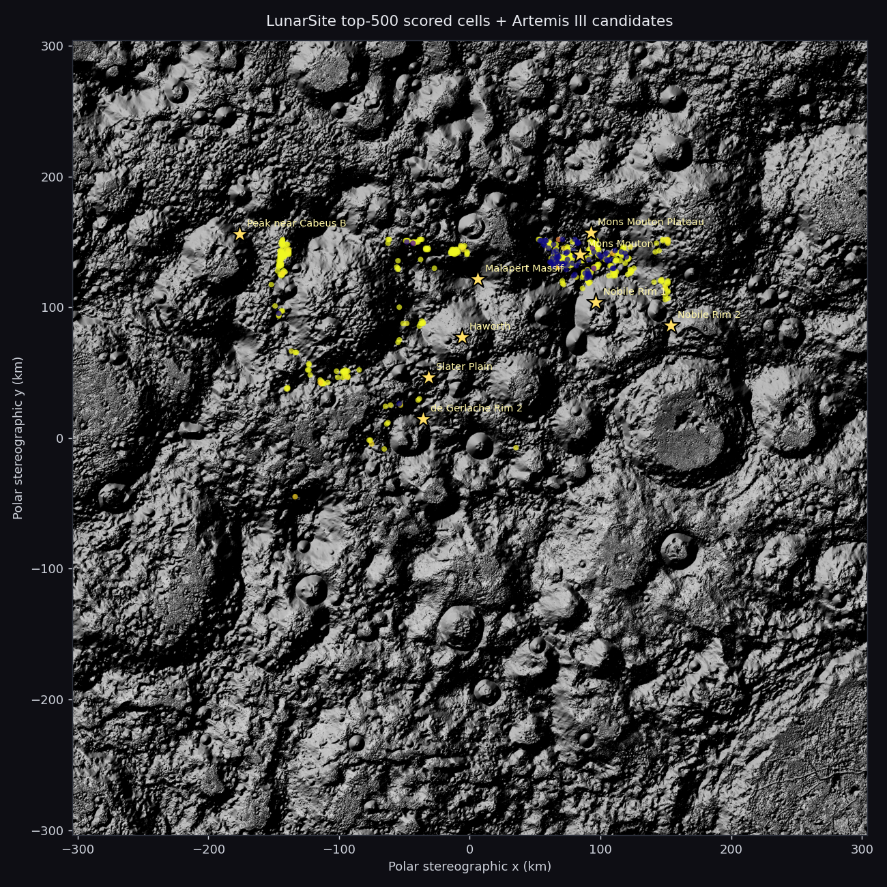

# LunarSite

**End-to-end machine learning pipeline for lunar south pole landing site selection.**

A pre-mission analysis tool that combines deep learning for crater detection and terrain segmentation with gradient-boosted scoring and SHAP explainability to rank candidate landing sites in the 80°S–90°S region. Built to fill the gap between NASA's deterministic SPLICE flight system and academic ML research on lunar terrain analysis.

> **Motivation:** The Intuitive Machines IM-2 south pole lunar crash (March 2025) validated the need for machine learning approaches to landing site selection — classical geometric algorithms failed under the extreme lighting conditions of the south pole. LunarSite is an attempt to build the kind of ML-first pre-mission analysis tool that the commercial lunar industry needs.

## Live Demo

**[Try the interactive demo →](https://lunarsite.streamlit.app)**

The demo walks the full three-stage pipeline on the real lunar south pole, with per-stage metrics, SHAP explainability, and a side-by-side comparison against NASA's independent Artemis III candidate regions.



*LunarSite's top-500 scored cells (color-graded) vs the 9 NASA Artemis III candidate regions (gold stars) on the LOLA south pole DEM hillshade.*

## Headline results (Layer 2)

| Stage | What it does | Key metric |
|---|---|---|
| **Stage 1 — Crater Detection** | U-Net on DEM tiles, fine-tuned on LOLA south pole | **Test IoU 0.162, recall 0.37** (v1→v2 recall +140%) |
| **Stage 2 — Terrain Segmentation** | U-Net + ResNet-34 on optical imagery | **Test mIoU 0.8456** with flip TTA, transfers to real orbital views |
| **Stage 3 — XGBoost Site Scorer** | 27 features × 315,034 cells over 80°S–90°S, CASSA pseudo-labels, SHAP | **5/9 Artemis III regions** overlap top-1000 cells |

**Artemis III validation (independent NASA analysis):**

| LunarSite top N | Regions matched (of 9) | Key hits |
|---|---|---|
| Top 100 | 2 | Mons Mouton (18 cells), Plateau (5) |
| Top 500 | 4 | + Nobile Rim 1, de Gerlache Rim 2 |
| Top 1000 | 5 | + Malapert Massif (0.5 km from center) |

Mons Mouton dominates — the peak-of-eternal-light region NASA independently selected as the primary Artemis III candidate. Haworth is excluded, correctly, because it's a permanently shadowed region (0% illumination fails the CASSA ≥33% rule).

## Architecture

```
┌─────────────────────────────────────────────────────────────────┐
│                    LunarSite Pipeline                           │
│                                                                 │
│  ┌───────────────┐  ┌──────────────────┐  ┌──────────────────┐  │
│  │ Stage 1       │  │ Stage 2          │  │ PGDA GeoTIFFs    │  │
│  │ Crater Det.   │  │ Terrain Seg.     │  │ (slope, elev,    │  │
│  │ U-Net / DEM   │  │ U-Net / RGB      │  │  illum, earth)   │  │
│  └──────┬───────┘  └────────┬──────────┘  └───────┬─────────┘  │
│         │ crater_count       │ rock_coverage_%     │ slope      │
│         │ crater_coverage_%  │ large_rock_count    │ elevation  │
│         │ crater_diameter_m  │ shadow_coverage_%   │ illum %    │
│         └────────┬───────────┴──────────┬──────────┘            │
│                  │                      │                       │
│           ┌──────▼──────────────────────▼──────┐                │
│           │       Stage 3: XGBoost Scorer      │                │
│           │   27 features → suitability score  │                │
│           │        + SHAP explainability       │                │
│           └────────────────┬───────────────────┘                │
│                            │                                    │
│                    ┌───────▼────────┐                           │
│                    │  Ranked Sites  │                           │
│                    │  80°S – 90°S   │                           │
│                    └────────────────┘                           │
└─────────────────────────────────────────────────────────────────┘
```

## Ship definition

- **Layer 1 — Foundation** *(shipped 4/11)*: Stage 2 segmenter + sim-to-real + Streamlit v1.
- **Layer 2 — Deepening** *(shipped 4/18)*: Layer 1 + Stage 1 crater detection + Stage 3 XGBoost scorer + deep ensemble + Streamlit v2 with Artemis overlap.
- **Layer 3 — Validation & End Game** *(post-ship)*: Dark Terrain module (PSRs via ShadowCam), MC Dropout uncertainty, arXiv paper, commercial outreach, community launch.

## Reproducing the results

**One-command pipeline on the cached LOLA data:**

```bash
python scripts/run_pipeline.py
```

Runs Stage 1 → Stage 3 → regenerates demo assets. ~5 min on GPU, ~30 min CPU-only.

**Step by step:**

```bash
# Stage 1: detect craters on the south pole DEM
PYTHONPATH=src python scripts/crater_eval_lola.py \
    --checkpoint outputs/crater_v2_finetune_seed1/best_craterunet_v2_southpole_seed1.pt \
    --tta --threshold 0.25

# Stage 3a: build the feature matrix
PYTHONPATH=src python scripts/build_stage3_features.py \
    --dem data/raw/lola/LDEM_80S_80MPP_ADJ.TIF \
    --slope D:/lola_pgda/product90/LDSM_80S_20MPP_ADJ.TIF \
    --crater-mask outputs/crater_eval_lola_v2/pred.tif \
    --illumination D:/lola_pgda/product69/AVGVISIB_85S_060M_201608.TIF \
    --earth-vis D:/lola_pgda/product69/AVGVISIB_85S_060M_201608_EARTH.TIF \
    --cell-size-m 1000 \
    --out data/processed/stage3_features_80mpp_1km.parquet

# Stage 3b: train XGBoost + SHAP
PYTHONPATH=src python scripts/train_scorer.py \
    --features data/processed/stage3_features_80mpp_1km.parquet \
    --out-dir outputs/stage3_v1

# Run the Streamlit demo locally
streamlit run streamlit_app.py
```

## Project structure

```
Moon/
├── streamlit_app.py                    # Live demo (all 3 stages + upload)
├── demo_assets/                        # Preloaded demo examples + manifest
│   ├── real_moon/                      # Curated sim-to-real surface examples
│   ├── south_pole/                     # Real orbital south pole imagery
│   ├── stage1/                         # LOLA crater overlay
│   ├── stage3/                         # Top-sites map + SHAP + Artemis overlap
│   └── synthetic/                      # Benchmark example with GT
├── best_resnet34.pt                    # Stage 2 v1 production weights (97 MB)
├── src/lunarsite/                      # Importable package
│   ├── data/                           # Dataset classes (Stage 1 + 2)
│   └── features/                       # Stage 3 grid, LOLA extractor, CASSA labels
├── scripts/
│   ├── run_pipeline.py                 # One-command end-to-end runner
│   ├── kaggle_run.py                   # Kaggle automation (push / wait / pull)
│   ├── train_segmenter.py              # Stage 2 training
│   ├── crater_eval_lola.py             # Stage 1 inference on LOLA DEM
│   ├── crater_eval_sweep.py            # Stage 1 threshold + config sweep
│   ├── build_southpole_hdf5.py         # Stage 1 v2 fine-tune dataset builder
│   ├── project_robbins_to_dem.py       # Robbins catalog → LOLA-grid mask
│   ├── build_stage3_features.py        # Stage 3 feature matrix builder
│   ├── train_scorer.py                 # Stage 3 XGBoost + SHAP
│   ├── build_stage3_demo_assets.py     # Stage 1 + 3 Streamlit asset builder
│   └── ensemble_predict.py             # Stage 2 deep ensemble uncertainty
├── notebooks/
│   ├── train_segmenter_kaggle_v2.ipynb
│   ├── eval_v1_vs_v2_kaggle.ipynb
│   ├── train_crater_kaggle.ipynb
│   ├── finetune_crater_southpole_kaggle.ipynb
│   └── train_ensemble_seed{2..5}_kaggle.ipynb
├── configs/                            # YAML configs per stage
└── CLAUDE.md                           # Full project spec
```

## Data sources

| Stage | Dataset | Source | Status |
|---|---|---|---|
| 1 (train) | DeepMoon synthetic DEM + Head/Povilaitis catalog | [Zenodo 1133969](https://doi.org/10.5281/zenodo.1133969) | Used |
| 1 (fine-tune) | LOLA south pole + Robbins ≥3 km ring mask (334 tiles) | Derived; published as [encinas88/lunarsite-southpole-finetune](https://www.kaggle.com/datasets/encinas88/lunarsite-southpole-finetune) | Used |
| 1 (eval) | Robbins 2018 crater catalog | [USGS](https://astrogeology.usgs.gov/search/map/Moon/Research/Craters/lunar_crater_database_robbins_2018) | Used |
| 2 (train) | Artificial Lunar Rocky Landscape (9,766 synthetic) | [Kaggle: romainpessia](https://www.kaggle.com/datasets/romainpessia/artificial-lunar-rocky-landscape-dataset) | Used |
| 2 (real eval) | 36 real moon surface + 4 NASA south pole orbital | Kaggle dataset + NASA Images API | Used |
| 3 (features) | LOLA 20 m/px DEM + slope (PGDA product 90) | [NASA PGDA](https://pgda.gsfc.nasa.gov/products/90) | Used |
| 3 (features) | Mean illumination + Earth visibility (PGDA product 69, Mazarico 2011) | [NASA PGDA](https://pgda.gsfc.nasa.gov/products/69) | Used |
| 3 (validation) | NASA Artemis III candidate regions (9 sites) | NASA LPSC 2024/2025 abstracts + USGS shapefiles | Used |

## Stage-level details

### Stage 1 — Crater Detection

- **v1:** U-Net + ResNet-34 (ImageNet), Dice+BCE, AdamW+cosine, 40 epochs @ 256² on DeepMoon → test TTA IoU **0.327**.
- **v2 (production):** fine-tuned on 334 LOLA south pole tiles at 118 m/px, Robbins ≥3 km ring mask, 25 epochs @ lr=1e-5. Pre-FT zero-shot on south pole: IoU 0.021. **Post-FT: IoU 0.161** (held-out val), **IoU 0.162 / recall 0.372 on the full 7600×7600 LOLA DEM** (+23% IoU, +140% recall vs v1). Flip TTA at inference, threshold 0.25.

### Stage 2 — Terrain Segmentation (from Layer 1)

- U-Net + ResNet-34 + Dice+CE + flip TTA, test mIoU **0.8456**.
- 5-seed deep ensemble (test TTA 0.8445 ± 0.0013) with per-pixel epistemic uncertainty maps on the Streamlit demo.
- Zero-shot transfer to real Apollo/rover photography + real NASA south pole orbital views (class coverage within 2 pp of training distribution).

### Stage 3 — XGBoost Site Scorer

- **Grid:** 1 km cells, polar-stereographic-native, 315,034 cells over 80°S–90°S.
- **Features (27):** LOLA elevation/slope statistics, Stage 1 crater count/coverage/diameter, PGDA illumination %, Earth visibility %, cell position.
- **Labels:** CASSA rule-based pseudo-labels (slope ≤5°, illumination ≥33%, Earth visibility ≥50%). 419 suitable cells (0.13%).
- **Model:** XGBoost hist, 300 trees, depth 6, lr 0.05. Test AUC 1.0 (expected for rule-label reproduction).
- **SHAP:** top 3 features are the 3 CASSA rule inputs (sanity check); `elevation_std` emerges at #4 as a signal the rules don't encode.
- **Validation:** 5/9 Artemis III candidate regions overlap the top 1000 cells.

## Setup

```bash
git clone https://github.com/AlanSEncinas/LunarSite.git
cd LunarSite
pip install -r requirements.txt
pip install -e .

# Stage 3 feature pipeline needs the geospatial stack
pip install rasterio pyproj h5py xgboost shap scikit-learn pyarrow

streamlit run streamlit_app.py
```

For CUDA:
```bash
pip install torch torchvision --index-url https://download.pytorch.org/whl/cu124
```

## Roadmap

### Layer 1 — Foundation *(shipped 4/11/26)*
- [x] Stage 2 segmenter (test mIoU 0.8456)
- [x] v1 vs v2 full TTA eval matrix
- [x] Sim-to-real on 36 real moon photos
- [x] Streamlit v0

### Layer 2 — Deepening *(shipped 4/18/26)*
- [x] Stage 2 deep ensemble (5 seeds) + epistemic uncertainty
- [x] Stage 2 zero-shot transfer to real NASA south pole orbital views
- [x] Stage 1 v1 DeepMoon-trained crater U-Net
- [x] Stage 1 v2 fine-tuned on LOLA south pole (IoU 0.162, recall 0.37)
- [x] Stage 3 XGBoost + SHAP over 315k cells
- [x] Artemis III overlap validation (5/9 at top 1000)
- [x] End-to-end `run_pipeline.py`
- [x] Streamlit v2 with all three stages

### Layer 3 — Validation & End Game *(post-ship)*
- [ ] Dark Terrain module (ShadowCam, HORUS denoising, shadow-depth validation)
- [ ] MC Dropout uncertainty on the production ResNet (beyond deep ensemble)
- [ ] arXiv paper on novel contributions
- [ ] Commercial outreach to lunar lander companies
- [ ] Community launch (Reddit r/space, Hacker News)

## License

MIT — see [LICENSE](LICENSE).

## Acknowledgments

- **Ari Silburt** for [DeepMoon](https://github.com/silburt/DeepMoon) — the canonical DEM-based crater U-Net baseline.
- **Romain Pessia** for the [Artificial Lunar Rocky Landscape Dataset](https://www.kaggle.com/datasets/romainpessia/artificial-lunar-rocky-landscape-dataset).
- **Erwan Mazarico + Mike Barker** (NASA GSFC) for the PGDA south pole illumination and DEM products.
- **Stuart Robbins** for the 2018 global lunar crater catalog (1.3M craters).
- **Pavel Iakubovskii** for [`segmentation_models_pytorch`](https://github.com/qubvel-org/segmentation_models.pytorch).
- **Kaggle** for free P100/T4 compute.

## Author

**Alan Scott Encinas** — solo developer. LunarSite is both a portfolio project and a genuine contribution to open-source lunar science tooling. Not affiliated with NASA, JPL, or any commercial lunar company. Motivated by childhood excitement about space and the observation that the commercial lunar industry is starting to need tools like this.

[GitHub](https://github.com/AlanSEncinas) · [Demo](https://lunarsite.streamlit.app) · [alanscottencinas.com](https://alanscottencinas.com)
